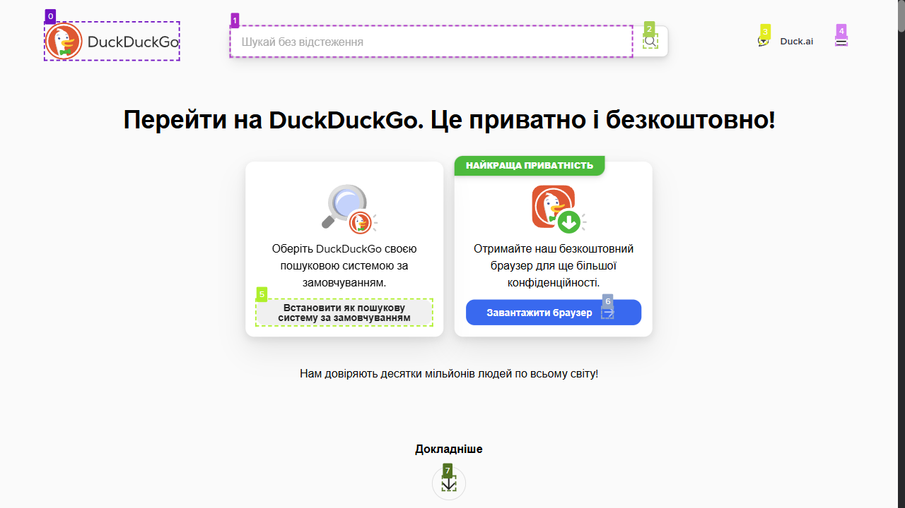
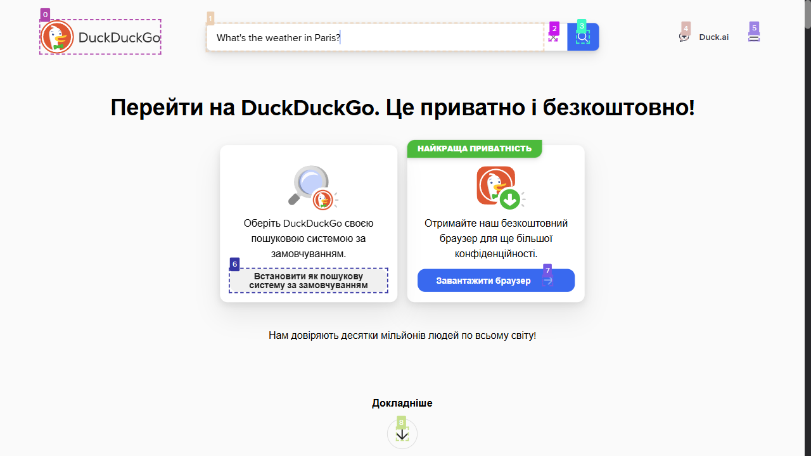
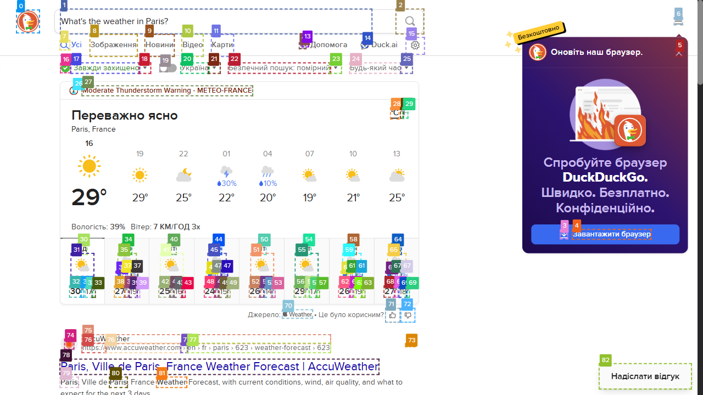

# WebVoyager RESTful API

A RESTful API implementation of the WebVoyager web navigation agent using LangGraph, Playwright, and FastAPI.

## Features

- **Async RESTful API** with FastAPI
- **Session Management** - Multiple concurrent browser sessions
- **Web Navigation** - Automated web browsing using AI

## Setup

### 1. Install Dependencies

```bash
pip install -r requirements.txt
```

### 2. Install Playwright Browsers

```bash
playwright install chromium
```

### 3. Set Environment Variables

Create a `.env` file or export environment variables:

```bash
export OPENAI_API_KEY="your-openai-api-key"
```

## Running the API

### Development

```bash
python entrypoint.py
```

### Production

```bash
uvicorn main:app --host 0.0.0.0 --port 8000 --workers 1
```

**Note**: Use only 1 worker due to browser session management.

## API Endpoints

### Create a New Session

`POST /sessions`

**Description:**  
Creates a new browser session with an optional timeout.

**Query Parameters:**  
- `timeout_minutes` (int, default=30) — Session timeout in minutes.

**Response:**  
- `session_id` (string): Unique identifier of the session.  
- `status` (string): Current status of the session.  
- `page_url` (string | null): URL of the initial browser page (if any).

---

### Close a Session

`DELETE /sessions/{session_id}`

**Description:**  
Closes an existing browser session by its ID.

**Path Parameters:**  
- `session_id` (string): ID of the session to close.

**Response:**  
- On success: JSON message confirming closure.  
- On failure: HTTP 404 if session not found.

---

### Get Session Information

`GET /sessions/{session_id}`

**Description:**  
Retrieve detailed information about a specific session.

**Path Parameters:**  
- `session_id` (string): Session ID.

**Response:**  
- `session_id` (string)  
- `status` (string)  
- `page_url` (string | null)  
- `current_query` (string | null): The latest query being processed.  
- `result` (string | null): Result of the last completed query.  
- `error` (string | null): Error message if any occurred.

---

### Query Web Agent

`POST /sessions/{session_id}/query`

**Description:**  
Execute a query using the web agent associated with a session. The query is processed asynchronously in the background.

**Path Parameters:**  
- `session_id` (string): Session to run the query in.

**Request Body:**  
- `question` (string): Query question to ask the agent.  
- `max_steps` (int): Maximum number of agent steps allowed during query processing.

**Response:**  
- `session_id` (string)  
- `status` (string): `processing`, `completed` or `error`.  
- `answer` (string | null): `null` initially; updated once processing completes.

---

### List Active Sessions (Monitoring)

`GET /sessions`

**Description:**  
Retrieve a list of all active sessions and count for monitoring purposes.

**Response:**  
- `active_sessions` (int): Number of active sessions.  
- `sessions` (array): Summary info for each active session.

---

## Usage Example

```bash
python entrypoint.py
python client.py
```





**As a result, the agent issues the following response:**
```markdown
Weather answer: The weather in Paris, France is currently mostly clear with a temperature of 29°C.
```

## Environment Variables

- `OPENAI_API_KEY` - Required for OpenAI API access
- `OPENAI_MODEL` - The model you have chosen
- `OPENAI_MAX_TOKENS` - The maximum number of tokens to generate in the completion